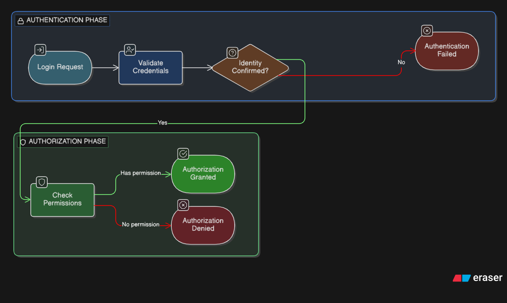
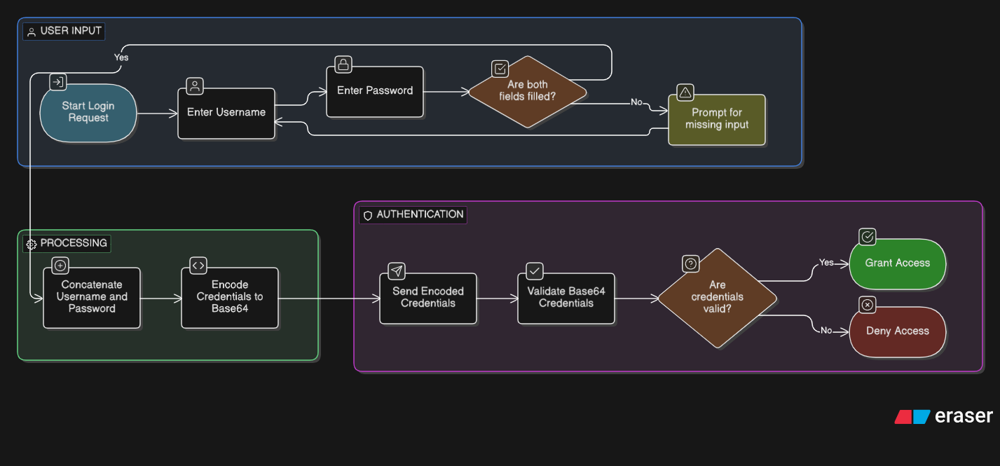
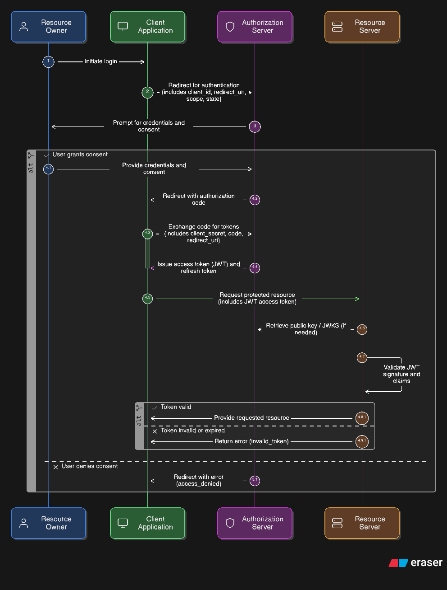
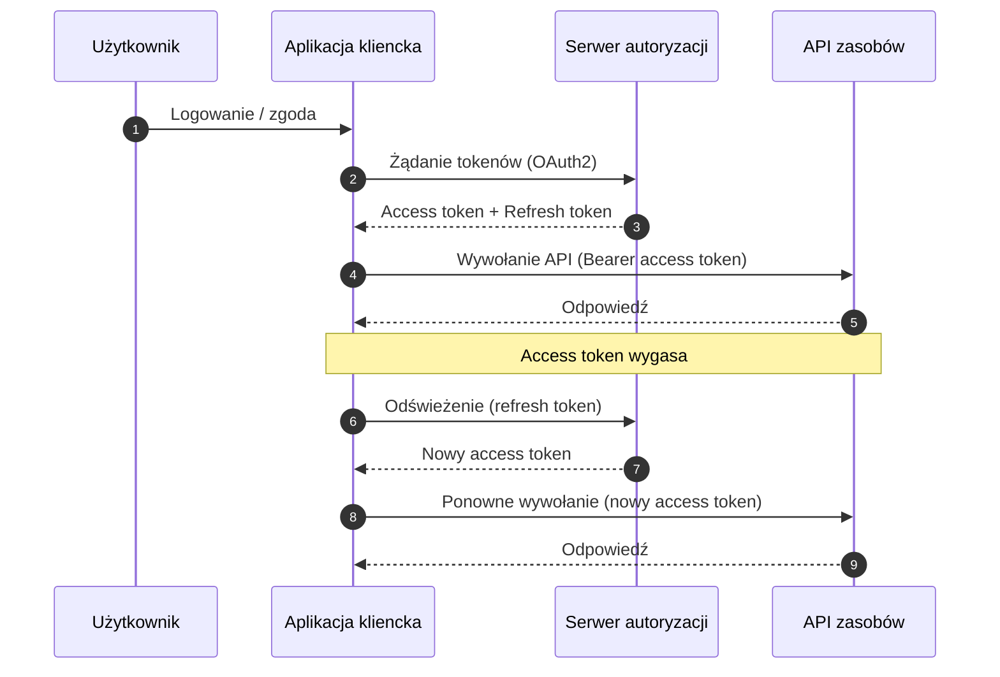
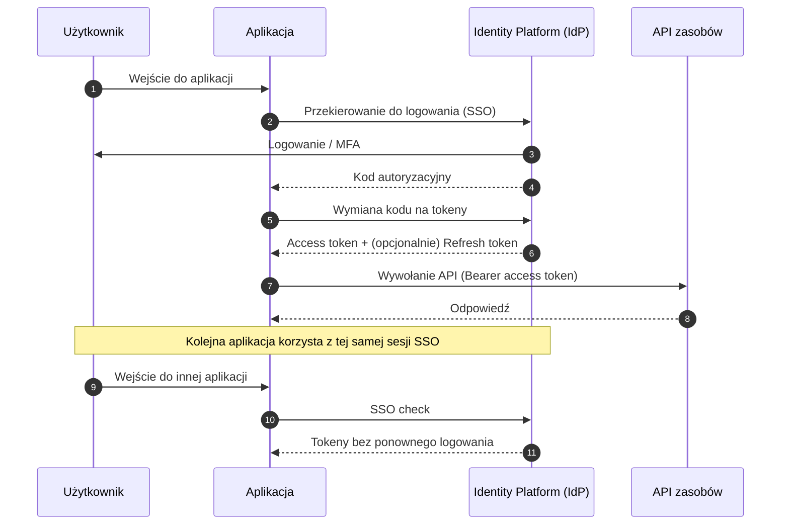

# Auth Diagrams explained

## Basic authentication & authorization initial flow

## Basic base64 (username + password) - rarely used

## OAuth2 & JWT token

- **OAuth2** to standard autoryzacji, który pozwala aplikacjom uzyskać ograniczony dostęp do zasobów użytkownika bez przekazywania hasła. Definiuje role (np. klient, serwer autoryzacji, serwer zasobów) oraz przepływy (granty), które określają jak bezpiecznie pozyskać token dostępu. Zwykle to token, a nie hasło, trafia do API. OAuth2 jest powszechnie wykorzystywany przez dostawców tożsamości takich jak Google, Microsoft, GitHub czy Facebook.

- **JWT (JSON Web Token)*** to samodzielny token w formacie JSON, podpisany (a czasem szyfrowany), który przenosi zestaw roszczeń (claims) o użytkowniku i kontekście dostępu. JWT jest z natury bezstanowy — serwer nie musi przechowywać sesji, a weryfikuje jedynie podpis tokenu. Przykładowy payload JWT może wyglądać tak:

{
	"sub": "123456",
	"name": "Jan Kowalski",
	"email": "jan.kowalski@example.com",
	"role": ["Admin", "User"],
	"iat": 1700000000,
	"exp": 1700003600,
	"iss": "https://idp.example.com",
	"aud": "image-gallery-api"
}

    Payload opisuje tożsamość oraz zakres uprawnień i jest weryfikowany przez API na podstawie podpisu tokenu.

## Access Tokens vs Refresh Tokens

- **Access token** służy do wywoływania chronionych API. Jest krótko ważny (zwykle od kilku do kilkunastu minut), aby ograniczyć skutki ewentualnego wycieku. Wysyłasz go do API w nagłówku `Authorization: Bearer <token>`.

- **Refresh token** służy tylko do uzyskania nowego access tokena, gdy ten wygaśnie. Ma dłuższy czas życia (np. dni lub tygodnie) i powinien być przechowywany możliwie najbezpieczniej (np. HttpOnly cookie lub bezpieczny magazyn po stronie klienta). Używa się go wyłącznie w komunikacji z serwerem autoryzacji (token endpoint), nie z API zasobów.

## SSO + Identity Platform flow

SSO (Single Sign-On) polega na tym, że użytkownik loguje się raz do dostawcy tożsamości (IdP), a kolejne aplikacje korzystają z tej samej sesji. Identity Platform zarządza logowaniem, MFA, zgodami i wydaje tokeny, dzięki czemu aplikacje nie muszą samodzielnie przechowywać haseł ani budować własnej logiki uwierzytelniania.

