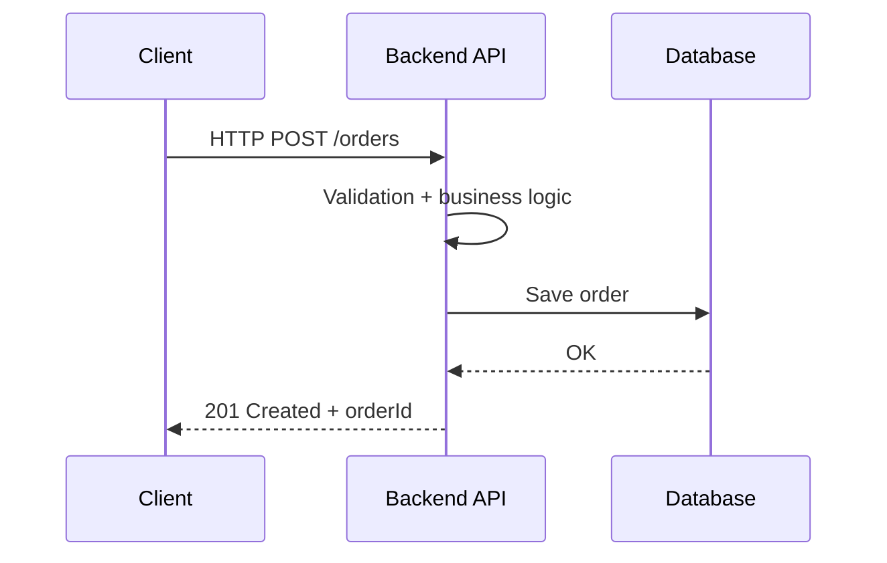
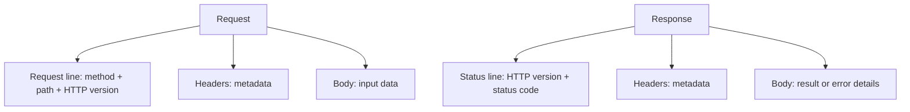
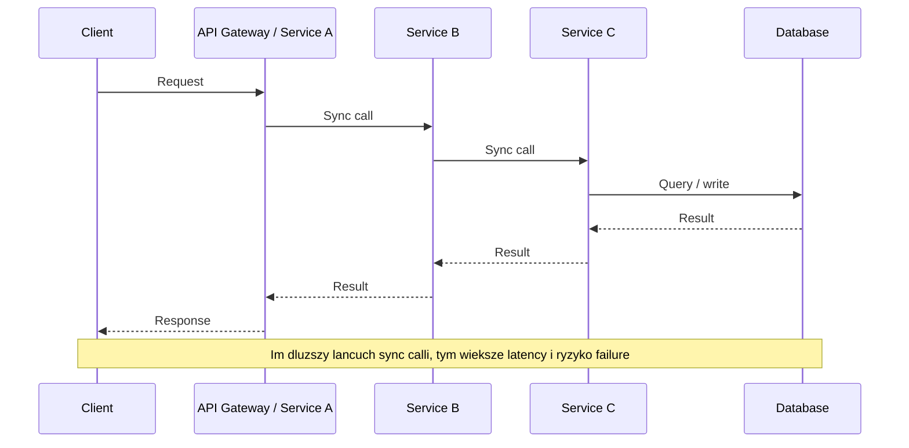
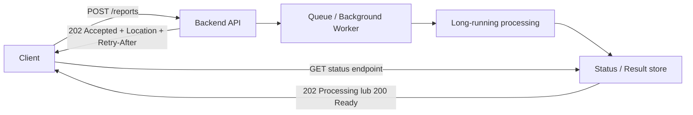

# Request-Response Pattern

`Request-response` to jeden z najbardziej podstawowych `communication patterns` w backendzie.  
W praktyce oznacza, że `client` wysyła `request` do `servera` albo innego `service`, a potem czeka na `response`.

Najczęściej ten wzorzec spotkasz w:

- `HTTP/HTTPS`
- `REST API`
- `gRPC` typu `unary RPC`
- komunikacji `service-to-service`, gdy potrzebna jest natychmiastowa odpowiedź

Według `RFC 9110` HTTP jest `stateless request/response protocol`, czyli każde żądanie i odpowiedź tworzą osobną wymianę wiadomości, a sam protokół nie zakłada trzymania stanu konwersacji między kolejnymi requestami.

## Na czym to polega

Najprostszy model wygląda tak:

1. `Client` wysyła `request`.
2. Backend odbiera żądanie.
3. Serwis wykonuje `validation`, `business logic` i ewentualnie wywołuje `database` albo inne usługi.
4. Backend zwraca `response`.
5. `Client` dopiero po otrzymaniu odpowiedzi wie, czy operacja się udała i co robić dalej.

To jest zwykle komunikacja **synchroniczna z perspektywy architektury**:

- nadawca czeka na wynik
- obie strony są czasowo powiązane (`temporal coupling`)
- jeśli downstream service nie odpowie, upstream też często nie może zakończyć operacji

## Ważne rozróżnienie: `async/await` != async pattern

To, że w kodzie backendu używasz `async/await`, nie oznacza jeszcze, że architektonicznie masz komunikację asynchroniczną.

- `HTTP request-response` nadal jest zwykle patternem synchronicznym
- `async/await` pomaga nie blokować `threada`
- ale `caller` i tak nadal czeka na finalny `response`

Czyli:

- `asynchronous I/O` to detal implementacyjny
- `asynchronous protocol` to cecha sposobu komunikacji między systemami

## Podstawowy przepływ



## Jak rozumieć `request` i `response`

W świecie `HTTP` request zwykle zawiera:

- `method` jak `GET`, `POST`, `PUT`, `DELETE`
- `URL`
- `headers`
- opcjonalny `body`

Response zwykle zawiera:

- `status code` jak `200 OK`, `201 Created`, `400 Bad Request`, `404 Not Found`, `500 Internal Server Error`
- `headers`
- opcjonalny `body`

Ważne:

- `GET` najczęściej służy do odczytu
- `POST` zwykle uruchamia processing albo tworzy zasób
- `PUT` zwykle zastępuje stan zasobu
- część metod ma cechy takie jak `idempotency`, co ma ogromne znaczenie przy retry

## Anatomia `request`

Typowy `HTTP request` można rozłożyć na kilka elementów:

1. `Request line`
   `POST /orders HTTP/1.1`
2. `Headers`
   np. `Content-Type`, `Authorization`, `Accept`, `User-Agent`
3. `Body`
   dane wejściowe, zwykle `JSON`, czasem `XML`, `form-data` albo `binary`

Przykład:

```http
POST /orders HTTP/1.1
Host: api.shop.com
Authorization: Bearer <token>
Content-Type: application/json
Accept: application/json
X-Correlation-ID: 9f2c3a10

{
  "customerId": 123,
  "items": [
    { "productId": 10, "quantity": 2 }
  ]
}
```

Jak to czytać:

- `POST` mówi, jaki typ operacji wykonujemy
- `/orders` wskazuje `resource` albo endpoint
- `headers` niosą metadane
- `body` zawiera właściwe dane biznesowe

## Anatomia `response`

Typowy `HTTP response` też ma stałą strukturę:

1. `Status line`
   `HTTP/1.1 201 Created`
2. `Headers`
   np. `Content-Type`, `Location`, `Cache-Control`
3. `Body`
   wynik operacji albo opis błędu

Przykład:

```http
HTTP/1.1 201 Created
Content-Type: application/json
Location: /orders/456
X-Correlation-ID: 9f2c3a10

{
  "orderId": 456,
  "status": "Created"
}
```

Jak to czytać:

- `201 Created` informuje, że zasób został utworzony
- `Location` może wskazać adres nowego zasobu
- `body` zwraca dane potrzebne klientowi

## Anatomia w skrócie



## Najważniejsze cechy wzorca

### 1. Prostota mentalna

To bardzo intuicyjny model:

- wysyłam żądanie
- dostaję wynik
- od razu wiem, czy operacja się udała

Dlatego `request-response` jest naturalne dla:

- `login`
- pobierania danych
- walidacji
- prostych `CRUD operations`
- wywołań, gdzie użytkownik oczekuje szybkiej odpowiedzi

### 2. Szybki feedback

Klient od razu dostaje:

- wynik operacji
- błąd
- identyfikator utworzonego zasobu
- aktualny stan danych

### 3. Twarde powiązanie czasowe

To najważniejsza wada tego podejścia. Jeśli serwis `A` podczas obsługi requestu musi wywołać serwis `B`, a `B` musi wywołać `C`, to cały łańcuch robi się coraz bardziej kruchy.



W praktyce oznacza to:

- rośnie `latency`
- rośnie ryzyko `timeout`
- łatwiej o `cascading failure`
- trudniej skalować cały flow

## Zalety

- Prosty model programistyczny i łatwy `debugging`
- Naturalne dopasowanie do `HTTP`, `REST` i `unary RPC`
- Klient od razu zna rezultat operacji
- Łatwo zbudować kontrakt API przez `OpenAPI` albo `proto`
- Dobrze działa dla krótkich operacji i odczytów

## Wady

- `Caller` musi czekać na odpowiedź
- Serwisy są zależne od swojej dostępności w tym samym czasie
- Długi `processing` łatwo prowadzi do `timeout`
- Łańcuch wywołań synchronicznych pogarsza `resilience`
- Przy większej liczbie downstream calls trudniej utrzymać niski czas odpowiedzi

## Kiedy ten pattern pasuje

`Request-response` jest dobrym wyborem, gdy:

- potrzebujesz odpowiedzi natychmiast
- operacja trwa krótko
- użytkownik czeka na wynik tu i teraz
- chcesz prostego API
- odczytujesz dane albo wykonujesz niewielką zmianę stanu

Przykłady:

- `GET /products/123`
- `POST /auth/login`
- `POST /payments/validate`
- `PUT /users/42`

## Kiedy nie jest najlepszy

Jeśli operacja:

- trwa długo
- odpala ciężki `background processing`
- przechodzi przez wiele serwisów
- nie musi zwracać wyniku od razu

to lepszy bywa model `async request-reply` albo komunikacja oparta o `queue` / `events`.

Microsoft i AWS zwracają uwagę, że komunikacja synchroniczna jest prosta, ale zwiększa zależność między serwisami, a długie łańcuchy wywołań mogą pogarszać `latency` i `availability`.

## W jakich przypadkach ten model może nie działać dobrze

`Request-response` nie jest zły sam w sobie, ale są klasy systemów i use case'y, w których zaczyna być niewygodny, kosztowny albo po prostu zawodny.

### 1. `Long-running operations`

Słabo działa w serwisach, które wykonują operacje trwające długo, np.:

- generowanie raportów
- eksport dużych plików
- renderowanie video
- trenowanie modelu
- przetwarzanie wsadowe

Problem:

- klient musi długo czekać
- łatwo o `timeout`
- trzymasz otwarte połączenie bez sensu

### 2. Systemy `event-driven`

W aplikacjach opartych o `events` i luźne powiązania między komponentami ten model często jest zbyt sztywny.

Przykłady:

- `event-driven architecture`
- systemy z `message brokerem`
- integracje oparte o `Kafka`, `RabbitMQ`, `Azure Service Bus`

Problem:

- nadawca nie powinien czekać na natychmiastową odpowiedź
- ważniejsze jest niezawodne dostarczenie komunikatu niż szybki `response`
- lepiej działa `publish-subscribe` albo `queue-based communication`

### 3. Mikroserwisy z długim łańcuchem zależności

W `microservices architecture` request-response bywa problematyczny, gdy jedno wywołanie przechodzi przez wiele serwisów.

Przykłady:

- `API Gateway` -> `Orders` -> `Payments` -> `Inventory` -> `Shipping`
- orkiestracja kilku systemów podczas jednego requestu użytkownika

Problem:

- sumuje się `latency`
- rośnie ryzyko `partial failure`
- awaria jednego serwisu psuje cały flow
- trudniej osiągnąć dobrą `resilience`

### 4. Systemy o dużym ruchu i skokowym obciążeniu

Ten model nie zawsze skaluje się dobrze w aplikacjach, gdzie ruch przychodzi falami i trzeba go wygładzić.

Przykłady:

- `ticketing systems`
- `flash sales` w `e-commerce`
- systemy rejestracji na wydarzenia
- masowe przyjmowanie zleceń lub uploadów

Problem:

- wszystko dzieje się "tu i teraz"
- backend musi obsłużyć pik natychmiast
- trudniej zastosować naturalny `buffer`

W takich przypadkach `queue` często stabilizuje system lepiej niż czyste synchroniczne API.

### 5. Systemy wymagające wysokiej odporności na chwilowe awarie

Jeśli system ma działać mimo chwilowej niedostępności części komponentów, czysty `request-response` może być zbyt delikatny.

Przykłady:

- integracje między firmami
- systemy płatności i rozliczeń
- przetwarzanie zamówień między wieloma bounded contextami

Problem:

- obie strony muszą być dostępne w tym samym momencie
- chwilowy brak odpowiedzi zatrzymuje processing
- potrzebujesz `retry`, `dead-letter queue`, `store-and-forward`

### 6. Real-time streaming i ciągły przepływ danych

To podejście nie pasuje najlepiej do komunikacji, która jest ciągła, a nie jednorazowa.

Przykłady:

- `live notifications`
- streaming telemetrii
- `chat`
- aktualizacje giełdowe lub IoT

Problem:

- model jedno żądanie -> jedna odpowiedź jest za wąski
- lepsze są `WebSocket`, `server-sent events`, `streaming gRPC` albo `event streams`

### 7. Heavy `background jobs`

Jeśli serwis pełni głównie rolę `job processor`, to request-response zwykle jest tylko warstwą wejściową, a nie właściwym modelem pracy.

Przykłady:

- wysyłka maili
- przeliczanie statystyk
- synchronizacja danych z zewnętrznymi systemami
- pipeline do obróbki dokumentów

Problem:

- właściwa praca dzieje się poza cyklem żądanie-odpowiedź
- ważniejsze jest kolejkowanie, priorytety, retry i obserwowalność jobów

## Krótka heurystyka

Jeśli odpowiedź ma być:

- szybka
- krótka
- deterministyczna
- potrzebna od razu użytkownikowi

to `request-response` zwykle pasuje.

Jeśli operacja ma być:

- długa
- odporna na chwilowe awarie
- łatwo skalowalna przez buforowanie ruchu
- rozproszona między wiele komponentów
- wykonywana w tle

to często lepszy jest model asynchroniczny.

## Kontrast: sync `request-response` vs `async request-reply`

Gdy backend nie jest w stanie sensownie odpowiedzieć szybko, lepiej nie trzymać klienta na otwartym połączeniu.



To podejście jest lepsze np. dla:

- generowania raportów
- eksportów danych
- przetwarzania plików
- ciężkich workflow

## Dobre praktyki przy `request-response`

- Ustal jasny `API contract`
- Pilnuj krótkich `timeouts`
- Stosuj `retry` tylko tam, gdzie operacja jest `idempotent`
- Dodawaj `correlation ID` do śledzenia requestów
- Unikaj głębokich łańcuchów synchronicznych między mikroserwisami
- Dla długich operacji zwracaj `202 Accepted` i przenoś processing do asynchronicznego flow
- Monitoruj `latency`, `error rate`, `timeout rate`

## Krótkie podsumowanie

`Request-response` to podstawowy wzorzec komunikacji backendowej, w którym jedna strona wysyła żądanie, a druga zwraca odpowiedź. Jest prosty, bardzo popularny i świetny dla szybkich operacji oraz API wystawianych do klienta. Problem zaczyna się wtedy, gdy próbujemy budować na nim długie łańcuchy zależności między serwisami albo obsługiwać operacje, które powinny działać w tle.

## Oficjalne źródła

- `RFC 9110 - HTTP Semantics`: https://www.rfc-editor.org/rfc/rfc9110
- `MDN - HTTP request methods`: https://developer.mozilla.org/en-US/docs/Web/HTTP/Methods
- `AWS Prescriptive Guidance - Synchronous communication`: https://docs.aws.amazon.com/prescriptive-guidance/latest/modernization-integrating-microservices/synchronous.html
- `AWS Prescriptive Guidance - Communication patterns`: https://docs.aws.amazon.com/prescriptive-guidance/latest/modernization-integrating-microservices/communication-patterns.html
- `Microsoft Learn - Design interservice communication for microservices`: https://learn.microsoft.com/azure/architecture/microservices/design/interservice-communication
- `Microsoft Learn - Asynchronous Request-Reply pattern`: https://learn.microsoft.com/azure/architecture/patterns/asynchronous-request-reply
- `gRPC - Core concepts, architecture and lifecycle`: https://grpc.io/docs/what-is-grpc/core-concepts/
