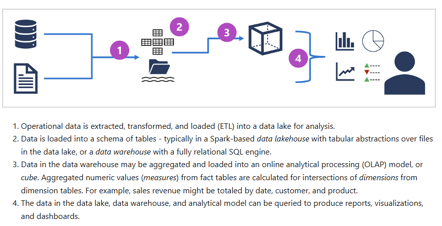

# Core Concepts

# 1. Three ways to represent data
- Structured Data
- Unstructured Data
- Semi-structured Data

## *Structured Data*
- has all the same shape, fixed schema
- organized in rows and columns
- rows represent one entity
- columns represent attribute of entity

Features of Structured Data
- the data has a strict format - rows and columns or objects and properties.
- usually associared with relational databases (for example SQL server, MYSQL or PostgreSQL).
- its easy to query

## *Unstructured Data*
- does not follow a strict format for examples text documents, word files, pdfs, video, audio files, emails etc.
- can live almost everywhere in file systems in cloud storage like Azure Blob Storage.
- data is not organized into any predefined structure.
- Windows File Folder, Blob Container.

## *Semi-Structured Data*
- data is labeled but the data doesn't have a set "shape"
- the data has some structure to it, but it's not script.
- for each object, not all properties must be present.
- The format of the data is often in a text format file like XML or JSON.
- The data can be searched, but it's not optimal.
- uses tags and labels

Common text-based markup/serializtion languages:
- html, yaml, json, xml. 

> For instance one json object can include phone number and another not. Program can parse them but it has to be flexible.

---

<br>

# 2. Options for data storage

### 💡 Common data file formats
- CSV, JSON, XML, **Parquet** (columnar data format) / **Avro** (row-based format. Each record contains a header that describes the structure of the data in the record. This header is stored as JSON. The data is stored as binary information) / **ORC** (optimized row columnar format - organizes into columns rather than rows).

### Binary Large Object (BLOB)
- All files are stored as binardy data (1's and 0's). Common types of data stored as binary include images, video, audio and application-specific documents.

### 💡 Types of Databases 
```text
🗄️ Relational Databases (SQL) for Structured Data 
   → Rows and columns
   → Schemas
   → Structured Data
   → SQL, MySQL, PostgreSQL, Azure SQL Database
```
---
```text
📊 Non-Relational Databases (NoSQL) for Semi-Structured or Unstructured
  → Key - Value Stores (very fast, great for caching). Example: Azure Table Storage or Redis.
  → Document Databases (store JSON-like documents). Example: Azure Cosmos DB.
  → Column - Family Stores (optimzed for analytics) - store tabular data comprising rows and columns, each column family holds a set of columns that are logically related together. Example: Apache Cassandra.
  → Graph Databases (focuses on relationships - nodes and edges). Example: Neo4j or Cosmos DB's Gremlin API.
```

### Example scenarios for Illustrate Choices
- Data transferred from external suppliers using XML Format,
- Data Stored internally in SQL Database,
- Database is backed up to an Azure Storage Account,
- Website logs also kept in Storage Account - can be stored in blob container.

---

<br>

# 3. Common Data Workloads
### Types of Workload

There are three main (relational) dataase workloads:
- As place to store business transactions as they occur (OLTP),
- As a place to hold data for comples analysis (OLAP),
- As a centralized repository for data from different sources (data warehouse).

## 📊 OLTP - Online Transaction Processing

### What is OLTP?
- **Purpose**: Most business applications require a place to store and retrieve data, basically only for operations.
- **Process**: As business transactions occur, they are recorded to the database
- **Flexibility**: Existing rows can be updated
- **Access**: Data can be retrieved by SQL queries
- **Performance**: Optimized for general use (using indexes)
- Support so-called **ACID** semantics: Atomicity, Consistency, Isolation and Durability.

### 🔧 Key Traits of OLTP

| Characteristic | Description |
|----------------|-------------|
| **📐 Structure** | Database normalization (breakup of data to specific tables) |
| **🛡️ Data Quality** | Schema heavily enforced, data integrity |
| **⚡ Consistency** | Strong consistency (freshes data) |
| **📈 Usage Pattern** | Heavy writes, moderate reads |
| **✏️ Mutability** | Updateable |
| **💾 Data Size** | MBs to TBs |

### 💾 Azure OLTP
- **Azure SQL Database**
- **SQL Server in a VM**
- **Azure Database for MySQL**
- **Azure Database for PostgreSQL**

## 📊 OLAP - Online Analytical Processing

### What is OLAP?
- **Problem**: Data stored in transactional databases was not designed for complex analysis
- **Challenge**: Transactional data can change at any time
- **Performance**: Running complex reports can slow down transactional databases
- **Preparation**: Takes time to prepare the data for analysis
- **Structure**: Uses cubes, dimensions, and measures

### 🔧 Key Traits of OLAP

| Characteristic | Description |
|----------------|-------------|
| **🔒 Locking** | No locking required |
| **✏️ Updates** | No updates - read-only |
| **📈 Usage Pattern** | Heavy reads, read-only access |
| **📐 Indexing** | Multi-dimensional indexing |
| **💾 Data Size** | GBs to TBs |

### 💾 Azure OLAP
- **SQL Server with Columnstore indexes**
- **Azure Analysis Services**
- **SQL Server Analysis Services**

The specific details for an analytical processing system can vary between solutions, but a common architecture for enterprise-scale analytics looks like this:



## 📊 Data Warehousing

### What is Data Warehousing?
- **Central Hub**: Repository of data from one or more different sources
- **Time Scope**: Stores current and historical data for reporting and analysis
- **Data Processing**: Can rename or reformat columns to make it easier for users to create reports
- **Isolation**: Users can run reports without affecting day-to-day business data systems

### 💾 Azure Data Warehousing Solutions

| Architecture Type | Solutions |
|------------------|-----------|
| **🔄 Symmetric Multiprocessing (SMP)** | • Azure SQL Database<br>• SQL Server in a VM<br>• SQL Server Analysis Services |
| **⚡ Massively Parallel Processing (MPP)** | • Azure Synapse Analytics (SQL DW)<br>• Apache Hive on HDInsight<br>• Interactive Query (Hive LLAP) on HDInsight |

### 🆚 SMP vs MPP Comparison

| Aspect | 🔄 **Symmetric Multiprocessing (SMP)** | ⚡ **Massively Parallel Processing (MPP)** |
|--------|----------------------------------------|-------------------------------------------|
| **🏗️ Architecture** | Single shared memory system | Distributed across multiple nodes |
| **💾 Memory** | All processors share the same memory | Each node has its own memory |
| **📊 Data Storage** | Centralized storage | Data distributed across nodes |
| **⚖️ Scalability** | Limited by shared resources | Highly scalable (add more nodes) |
| **💰 Cost** | Lower initial cost | Higher cost but better for large datasets |
| **🎯 Best For** | Small to medium workloads | Large datasets and complex analytics |
| **🔧 Maintenance** | Simpler to manage | More complex setup and management |
| **⚡ Performance** | Good for OLTP workloads | Excellent for OLAP and big data |

### 🤔 When to Use a Data Warehouse?

| Scenario | Description |
|----------|-------------|
| **⏱️ Performance Issues** | When queries are long-running or affect day-to-day operations |
| **🔄 Data Processing** | When data needs further processing (ETL or ELT) before analysis |
| **📦 Historical Archiving** | When you want to remove historical data from operational systems |
| **🔗 Data Integration** | When you need to integrate data from several sources |
| **🎯 User Experience** | When users are confused by data structures, table names, or column names when building reports in Power BI |

---

<br>

# 4. Common Data Roles

>## 👨‍💼 Database Administrator Roles

| Responsibility | Description |
|----------------|-------------|
| **🗃️ Database Management** | Design, implementation, maintenance, and operations |
| **⚡ Performance** | Ensure availability and consistent performance |
| **🔐 Security** | Assign permissions to users and manage access |
| **💾 Backup Management** | Set up and manage data backups - tools, policies and processes |
| **🚨 Disaster Recovery** | Handle data restores in case of emergency - including planning |

## 🔧 Data Engineer Roles

| Responsibility | Description |
|----------------|-------------|
| **🔄 Data Movement** | Move data between different systems in organization without error |
| **🧹 Data Quality** | Data cleaning routines and validation |
| **📋 Governance** | Apply data governance - privacy and GDPR compliance |
| **🔗 Data Pipelines** | Import and export data through automated pipelines |

## 📊 Data Analyst Roles

| Responsibility | Description |
|----------------|-------------|
| **💎 Value Creation** | Create business value from the data |
| **🔍 Data Exploration** | Explore data for trends, relationships, and analytical models |
| **📈 Visualization** | Create charts, reports, and visualizations |
| **💡 Insights** | Generate relevant insights based on data analysis |

>**Additional Roles**
> - Data scientist
> - Data architect
> - Application developer
> - Software engineer

---
<br>

# 5. Data Services

## Azure SQL
Azure SQL is the collective name for a family of relational database solutions based on Microsoft SQL Server database engine. Specific Azure SQL services include:
- **Azure SQL Database** -  a fully managed platform-as-a-service (PaaS) database hosted in Azure.
- **Azure SQL Managed Instance**
- **Azure SQL VM**

## Open-source databases in Azure
- **Azure Database for MySQL**
- **Azure Database for MariaDB** (MariaDB offers compatibility with Oracle Database)
- **Azure Database for PostgreSQL** -  a hybrid relational-object database. You can store data in relational tables, but a PostgreSQL database also enables you to store custom data types, with their own non-relational properties.

## Azure Cosmos DB
- Azure Cosmos DB is a global-scale non-relational (NoSQL) database system that supports multiple application programming interfaces (APIs), enabling you to store and manage data as JSON documents, key-value pairs, column-families, and graphs.

## Azure Storage
Azure Storage is a core Azure service that enables you to store data in:
- Blob Containers
- File shares
- Tables

## Azure Data Factory
- Azure Data Factory is an Azure service that enables you to define and schedule data pipelines to transfer and transform data. You can integrate your pipelines with other Azure services, enabling you to ingest data from cloud data stores, process the data using cloud-based compute, and persist the results in another data store.

- Azure Data Factory is used by data engineers to build extract, transform, and load (ETL) solutions that populate analytical data stores with data from transactional systems across the organization.

## Microsoft Fabric
- Microsoft Fabric is a unified Software-as-a-Service (SaaS) analytics platform based on an open and governed lakehouse.

## Azure Databricks
- Azure Databricks is an Azure-integrated version of the popular Databricks platform, which combines the Apache Spark data processing platform with SQL database semantics and an integrated management interface to enable large-scale data analytics.

# 6. Questions

1. A CSV file sitting in a Blob Storage account is an example of what type of data?
    - Bach Data 
    >- **Explanation**: When data is "at rest", it is considered batch data. This inscludes data in a file or database. Blob Storage containers would be batch data.

<br>

2. In the context of a relational database, what is the "schema"?
    - The structure of the database including table names, column names, data types, indexes and other database structure definitions.

<br>

3. What type of analytics answers the question "what happened", such as sales report for yesterday?
    - Descriptive (pl: opisowy np. o danych)
    > - **Explanation:** Descriptive Analytics is entirely based on data in the database, and tells you the current state of you business, Sales, orders, inventory, visits etc.

<br>

4. In the context of enterprise-wide data governance, what specific feature does Microsoft Purview offer to help ensure data integrity? 
    - Data lineage tracking across multiple sources and systems.

<br>

5. Which Azure service should a database administrator choose to implement a highly flexible and configurable SQL Server environment with full management responsibility?
    - Azure SQL VM
    > - **Explanation:** Highly flexible and configurable and full management responsibility -> IaaS model. Azure SQL Database and Azure SQL Managed Instance are PaaS models.

<br>

6. An organization needs to comply with data protection regulations across multiple regions. How can Microsoft Purview facilitate this compliance?
    - By enabling data classification and monitoring for sensitive data.

<br>

7. Your organization has deployed multiple data systems across different regions. How can Microsoft Purview assist in maintaining trustworthy data for analysis and reporting?
    - By providing a centralized data catalog for discovering and understanding data assets.