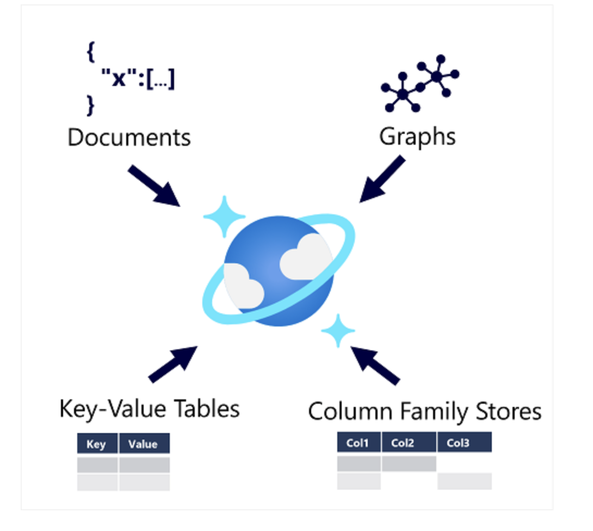

# Azure Cosmos DB

Azure Cosmos DB is a highly scalable, globally distributed NoSQL database service in Azure.

## Key Features
- **Multiple APIs:** Supports SQL, MongoDB, Cassandra, Gremlin, Table APIs—developers use familiar query languages.
- **Automatic partitioning:** Cosmos DB allocates space for partitions in containers; each partition can grow up to 10 GB.
- **Automatic indexing:** Indexes are created and maintained automatically for fast queries.
- **Global distribution:** Multi-region writes and reads, low latency for users worldwide.
- **Virtually no admin overhead:** Scaling, indexing, and partitioning are managed by Azure.

## When to use Cosmos DB
Cosmos DB is a foundational Azure service, used by Microsoft for mission-critical apps (Skype, Xbox, Microsoft 365, Azure).

### Typical scenarios

| Scenario | Why Cosmos DB? |
|----------|---------------|
| **IoT & telematics** | Handles large, bursty data ingestion; integrates with analytics and real-time processing (Azure ML, Power BI, Azure Functions). |
| **Retail & marketing** | Used for e-commerce platforms, catalog data, event sourcing in order pipelines. |
| **Gaming** | Delivers fast, personalized content (stats, leaderboards, social features); scales for spikes during launches. |
| **Web & mobile apps** | Models social interactions, integrates with third-party services, builds rich personalized experiences; SDKs for .NET MAUI, iOS, Android. |

---

**Summary:** Cosmos DB is ideal for applications needing global scale, high performance, flexible data models, and minimal database management.