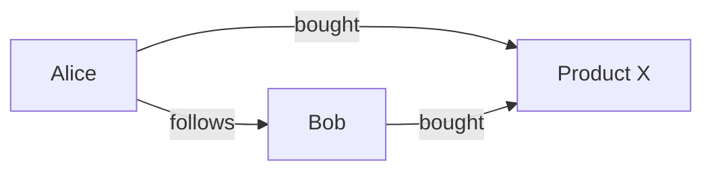
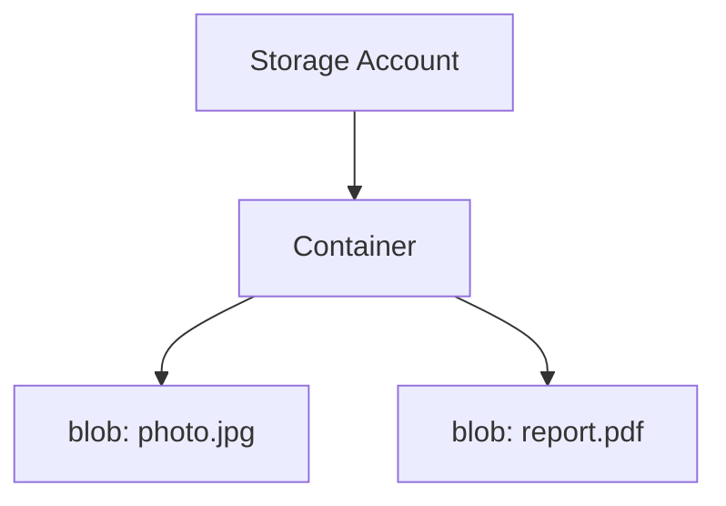
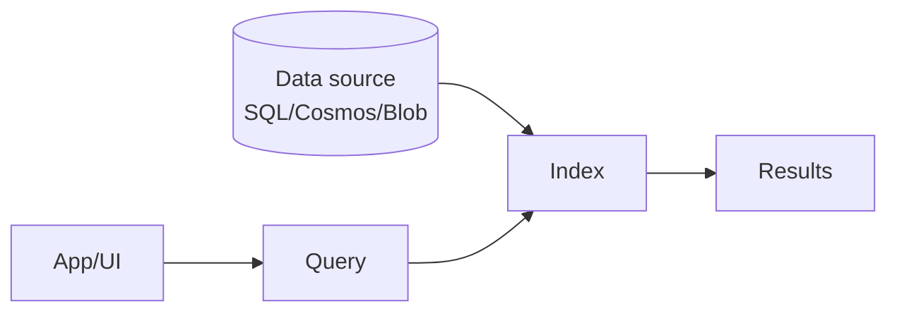

# Non-relational database concepts

## 🗺️ Quick map (type → typical Azure service)

| Data model | Typical Azure service |
|-----------|------------------------|
| **Document** | Azure Cosmos DB (Core / SQL API) |
| **Column-family (wide-column)** | Azure Cosmos DB (Cassandra API) |
| **Key-value** | Azure Cosmos DB (Table API) / Azure Table Storage |
| **Graph** | Azure Cosmos DB (Gremlin API) |
| **Time series** | (Commonly) Azure Data Explorer / Cosmos DB depending on scenario |
| **Object / file** | Azure Blob Storage |
| **Search** | Azure AI Search |

---

## 1. 📄 Document Data — Cosmos DB Core (SQL)

### ✅ Use cases
- User profiles, shopping carts, product catalogs
- Mobile/web apps needing flexible schema

### 📝 2‑sentence description
Stores data as **JSON documents** with a flexible schema. Best when your entities evolve over time and you want fast reads/writes with global distribution.

### 🧩 Example document (JSON)
```json
{
  "id": "u1",
  "name": "Alice",
  "email": "alice@example.com",
  "address": { "city": "Warsaw", "country": "PL" },
  "tags": ["premium", "newsletter"]
}
```

---

## 2. 🧱 Column‑Family (Wide‑Column) — Cosmos DB Cassandra API

### ✅ Use cases
- IoT telemetry, logs/events, high‑write workloads
- Large datasets queried by partition key / time buckets

### 📝 2‑sentence description
Optimized for **very large scale** and predictable access patterns (often by partition key). Great when you write a lot of rows and read them using known keys and clustering columns.

### 🗂️ Conceptual table (wide columns)
| Partition key (DeviceId) | Clustering (Timestamp) | Temperature | Humidity |
|---|---|---:|---:|
| dev‑01 | 2026‑02‑16T10:00:00Z | 21.4 | 40 |
| dev‑01 | 2026‑02‑16T10:01:00Z | 21.5 | 41 |

---

## 3. 🔑 Key‑Value Data — Cosmos DB Table API

### ✅ Use cases
- Fast lookups by key (settings, metadata, simple session/state)
- Scenarios where you mostly do `get by id` / `upsert`

### 📝 2‑sentence description
The simplest model: find a record using a **key** (often `PartitionKey` + `RowKey`). Best for quick, cheap lookups without complex joins or relationships.

### 🧩 Conceptual key structure
```mermaid
flowchart LR
  PK[PartitionKey: "users"] --> RK[RowKey: "u1"] --> V[Entity properties]
```

---

## 4. 🕸️ Graph Data — Cosmos DB Graph (Gremlin) API

### ✅ Use cases
- Social networks, recommendations, fraud detection
- Relationship‑heavy queries (paths, degrees of separation)

### 📝 2‑sentence description
Graph databases model data as **vertices (nodes)** and **edges (relationships)**. Best when connections are as important as the data itself, and you frequently traverse relationships.

### 🧩 Example graph


---

## 5. ⏱️ Time Series Data

### ✅ Use cases
- Metrics/monitoring, sensor readings, financial ticks
- Aggregations over time windows (minute/hour/day)

### 📝 2‑sentence description
Time series data is recorded as **measurements over time** and analyzed using time windows and aggregates. Best when you append new points continuously and query trends (min/max/avg) per interval.

### 📈 Conceptual shape
| Timestamp | Metric | Value |
|----------:|--------|------:|
| 10:00 | cpu_pct | 23 |
| 10:01 | cpu_pct | 35 |
| 10:02 | cpu_pct | 29 |

---

## 6. 🗃️ Object Data — Azure Blob Storage

### ✅ Use cases
- Images, videos, PDFs, backups, exports
- Data lake scenarios (raw files)

### 📝 2‑sentence description
Blob Storage stores **files/objects**, not rows/columns. Best for cheap, scalable storage of unstructured data and integration with analytics tools.

### 🧩 Storage hierarchy


---

## 7. 🔎 Azure AI Search (Azure Search)

### ✅ Use cases
- Full‑text search in apps (products, docs, articles)
- Faceted filtering, autocomplete, ranking

### 📝 2‑sentence description
Azure AI Search builds an **index** that enables fast full‑text search, filters, and scoring. It’s commonly used as a dedicated search layer on top of data stored in SQL/Cosmos/Blob.

### 🧩 Search architecture


## Benefits of NoSQL Databases

| Benefit | What it means (short) | Example |
|--------|------------------------|---------|
| **Flexible schema** | You can store different fields per item/document without migrations. | New property in JSON documents (e.g., `"loyaltyTier"`) only for some users. |
| **Horizontal scalability** | Scale out by adding partitions/nodes (not only bigger server). | Cosmos DB partitions data and scales throughput. |
| **High performance for specific access patterns** | Optimized for key lookups, document reads, or graph traversal. | Key-value reads by `PartitionKey + RowKey` are very fast. |
| **High availability** | Designed for resilience and replication. | Multi-region replication and failover options. |
| **Global distribution** | Data can be replicated closer to users worldwide. | Users in EU/US read from nearest region for lower latency. |
| **Handles semi/unstructured data well** | Great for JSON, events, logs, media, etc. | Telemetry events with varying shape per device type. |

> DP-900 note: NoSQL is not “better than SQL” — it’s better for **different requirements** (scale, flexibility, specific query patterns).

## Azure Non-Relational Data Options

### Blob Storage
- Azure Storage Account
- 5 PB maximum limit
- $0.0208 per GB - cheapest data storage option on Azure
- Supports premium, hot, cool, archive access tiers
- Support "reserved capacity" 0 ~$0.014 per GB for 100TB/3 years
- Supports blob indexing
- Plus pay for operations - $0.00036 per 10.000 transactions
- Service Level Agreement shockingly poor (2 second per MB)
---

### Cosmos DB
- Enterprise-grade non-relational database,
- Support many data models (graph, document, table, column-family),
- Compatible with established APIs (Cassandra, MongoDB, Gremlin, Etcd),
- Select the data consistency you need,
- Easy to scale worldwide,
- Sub-10 ms latency,
- Service Level Agreements for throughput, latency, availability and consistency.
--- 
### Table Storage
- Azure Storage Account
- 5 PB maximum limit
- $0.045 per GB - cheapest data storage option on Azure
- Plus pay for operations - $0.00036 per 10.000 transactions
- Service Level Agreement shockingly poor (10 second for query)
---
### File Storage 
- Azure Storage Account
- 5 PB maximum limit
- $0.06 per GB - cheapest data storage option on Azure
- Standard and premium options
- Service Level Agreement shockingly poor (2 seconds per MB)