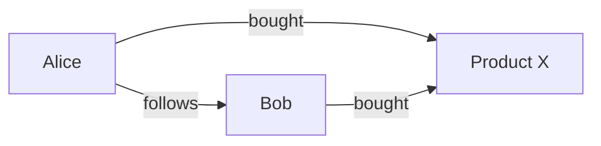
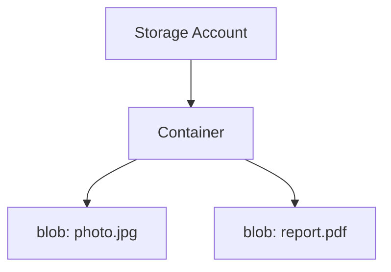
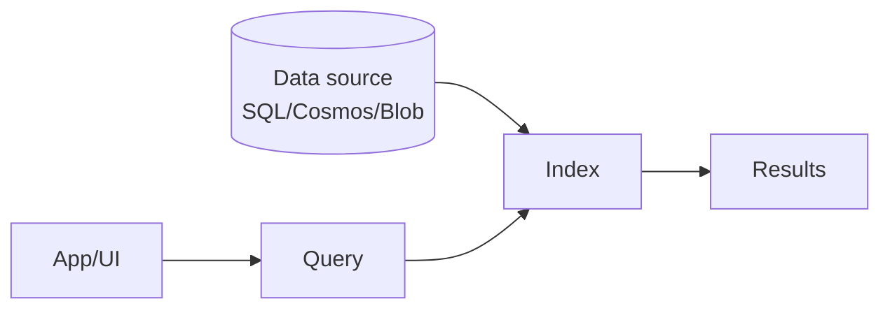
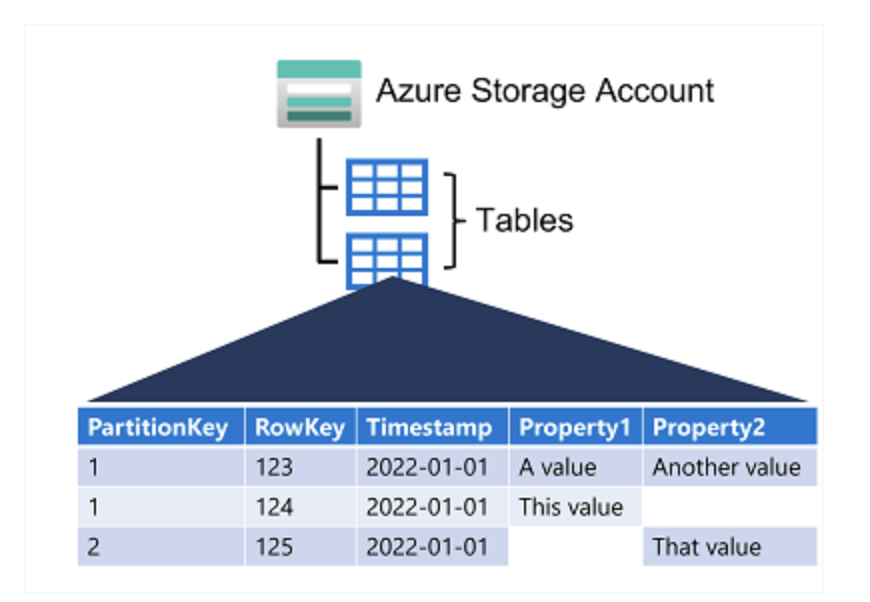

# Non-relational database concepts

## 🗺️ Quick map (type → typical Azure service)

| Data model | Typical Azure service |
|-----------|------------------------|
| **Document** | Azure Cosmos DB (Core / SQL API) |
| **Column-family (wide-column)** | Azure Cosmos DB (Cassandra API) |
| **Key-value** | Azure Cosmos DB (Table API) / Azure Table Storage |
| **Graph** | Azure Cosmos DB (Gremlin API) |
| **Time series** | (Commonly) Azure Data Explorer / Cosmos DB depending on scenario |
| **Object / file** | Azure Blob Storage |
| **Search** | Azure AI Search |

---

## 1. 📄 Document Data — Cosmos DB Core (SQL)

### ✅ Use cases
- User profiles, shopping carts, product catalogs
- Mobile/web apps needing flexible schema

### 📝 2‑sentence description
Stores data as **JSON documents** with a flexible schema. Best when your entities evolve over time and you want fast reads/writes with global distribution.

### 🧩 Example document (JSON)
```json
{
  "id": "u1",
  "name": "Alice",
  "email": "alice@example.com",
  "address": { "city": "Warsaw", "country": "PL" },
  "tags": ["premium", "newsletter"]
}
```

---

## 2. 🧱 Column‑Family (Wide‑Column) — Cosmos DB Cassandra API

### ✅ Use cases
- IoT telemetry, logs/events, high‑write workloads
- Large datasets queried by partition key / time buckets

### 📝 2‑sentence description
Optimized for **very large scale** and predictable access patterns (often by partition key). Great when you write a lot of rows and read them using known keys and clustering columns.

### 🗂️ Conceptual table (wide columns)
| Partition key (DeviceId) | Clustering (Timestamp) | Temperature | Humidity |
|---|---|---:|---:|
| dev‑01 | 2026‑02‑16T10:00:00Z | 21.4 | 40 |
| dev‑01 | 2026‑02‑16T10:01:00Z | 21.5 | 41 |

---

## 3. 🔑 Key‑Value Data — Cosmos DB Table API

### ✅ Use cases
- Fast lookups by key (settings, metadata, simple session/state)
- Scenarios where you mostly do `get by id` / `upsert`

### 📝 2‑sentence description
The simplest model: find a record using a **key** (often `PartitionKey` + `RowKey`). Best for quick, cheap lookups without complex joins or relationships.

### 🧩 Conceptual key structure
```mermaid
flowchart LR
  PK[PartitionKey: "users"] --> RK[RowKey: "u1"] --> V[Entity properties]
```

---

## 4. 🕸️ Graph Data — Cosmos DB Graph (Gremlin) API

### ✅ Use cases
- Social networks, recommendations, fraud detection
- Relationship‑heavy queries (paths, degrees of separation)

### 📝 2‑sentence description
Graph databases model data as **vertices (nodes)** and **edges (relationships)**. Best when connections are as important as the data itself, and you frequently traverse relationships.

### 🧩 Example graph

```mermaid
graph LR
  A[Alice] -- follows --> B[Bob]
  A -- bought --> P[Product X]
  B -- bought --> P
```

---

## 5. ⏱️ Time Series Data

### ✅ Use cases
- Metrics/monitoring, sensor readings, financial ticks
- Aggregations over time windows (minute/hour/day)

### 📝 2‑sentence description
Time series data is recorded as **measurements over time** and analyzed using time windows and aggregates. Best when you append new points continuously and query trends (min/max/avg) per interval.

### 📈 Conceptual shape
| Timestamp | Metric | Value |
|----------:|--------|------:|
| 10:00 | cpu_pct | 23 |
| 10:01 | cpu_pct | 35 |
| 10:02 | cpu_pct | 29 |

---

## 6. 🗃️ Object Data — Azure Blob Storage

### ✅ Use cases
- Images, videos, PDFs, backups, exports
- Data lake scenarios (raw files)

### 📝 2‑sentence description
Blob Storage stores **files/objects**, not rows/columns. Best for cheap, scalable storage of unstructured data and integration with analytics tools.

### 🧩 Storage hierarchy

```mermaid
flowchart TB
  SA[Storage Account] --> C[Container]
  C --> B1[blob: photo.jpg]
  C --> B2[blob: report.pdf]
```

---

## 7. 🔎 Azure AI Search (Azure Search)

### ✅ Use cases
- Full‑text search in apps (products, docs, articles)
- Faceted filtering, autocomplete, ranking

### 📝 2‑sentence description
Azure AI Search builds an **index** that enables fast full‑text search, filters, and scoring. It’s commonly used as a dedicated search layer on top of data stored in SQL/Cosmos/Blob.

### 🧩 Search architecture

```mermaid
flowchart LR
  DS[(Data source
SQL/Cosmos/Blob)] --> IDX[Index]
  APP[App/UI] --> Q[Query]
  Q --> IDX
  IDX --> RES[Results]
```

---

## Azure Data Lake Storage (Gen2)

Azure Data Lake Storage Gen2 is a scalable, secure cloud storage solution built on top of Azure Blob Storage, designed for big data analytics.

- **Purpose:** Store and process massive volumes of structured, semi-structured, and unstructured data for analytics and data science.
- **Key features:**
  - Hierarchical namespace (folders/subfolders, not just flat blobs)
  - Optimized for Hadoop/Spark and analytics workloads
  - Supports ACLs (Access Control Lists) for granular security
  - Integrates with Azure Synapse, Databricks, HDInsight, Power BI
- **Use cases:** Data lakes, ETL pipelines, machine learning, reporting, storing raw data for analytics.

> DP-900 note: Data Lake Gen2 is recommended for modern analytics scenarios requiring scalable, secure, and cost-effective storage. To create an Azure Data Lake Store Gen2 files system, you must enable the Hierarchical Namespace option of an Azure Storage account. 

## Benefits of NoSQL Databases

| Benefit | What it means (short) | Example |
|--------|------------------------|---------|
| **Flexible schema** | You can store different fields per item/document without migrations. | New property in JSON documents (e.g., `"loyaltyTier"`) only for some users. |
| **Horizontal scalability** | Scale out by adding partitions/nodes (not only bigger server). | Cosmos DB partitions data and scales throughput. |
| **High performance for specific access patterns** | Optimized for key lookups, document reads, or graph traversal. | Key-value reads by `PartitionKey + RowKey` are very fast. |
| **High availability** | Designed for resilience and replication. | Multi-region replication and failover options. |
| **Global distribution** | Data can be replicated closer to users worldwide. | Users in EU/US read from nearest region for lower latency. |
| **Handles semi/unstructured data well** | Great for JSON, events, logs, media, etc. | Telemetry events with varying shape per device type. |

> DP-900 note: NoSQL is not “better than SQL” — it’s better for **different requirements** (scale, flexibility, specific query patterns).

## Azure Non-Relational Data Options

### Blob Storage
- Azure Storage Account
- 5 PB maximum limit
- $0.0208 per GB - cheapest data storage option on Azure
- Supports premium, hot, cool, archive access tiers
- Support "reserved capacity" 0 ~$0.014 per GB for 100TB/3 years
- Supports blob indexing
- Plus pay for operations - $0.00036 per 10.000 transactions
- Service Level Agreement shockingly poor (2 second per MB)
- Supports three different types of blob: block blobs, page blobs and appends blobs.

#### Access Tiers in Azure Blob Storage
Azure Blob Storage supports **four access tiers**:

| Tier      | Purpose / Use case | Cost | Retrieval speed |
|-----------|--------------------|------|----------------|
| **Hot**     | Frequently accessed data (active workloads) | Higher | Fast |
| **Cool**    | Infrequently accessed, but still available (backups, older data) | Lower | Moderate |
| **Cold**    | Rarely accessed, lower cost than cool, for long-term storage with less frequent access | Even lower | Slower |
| **Archive** | Very rarely accessed, long-term retention (compliance, cold backups) | Lowest | Slowest (hours) |

> You can change tier per blob/container. Archive is for data you rarely need, hot for active workloads, cool/cold for less frequent access. A **lifecycle management** policy can automatically move a blob from Hot to Cool, then to Cold, and finally to the Archive tier, as it ages and is used less frequently (policy is based on the number of days since modification). A lifecycle management policy can also arrange to delete outdated blobs.


--- 
### Table Storage

- Azure Storage Account
- 5 PB maximum limit
- $0.045 per GB - cheapest data storage option on Azure
- Plus pay for operations - $0.00036 per 10.000 transactions
- Service Level Agreement shockingly poor (10 second for query)
- Azure Table enables you to store semi-structured data.
- Data in Azure Table storage is usually denormalized, with each row holding the entire data for a logical entity
- Azure Table Storage splits a table into partitions. Partitioning is a mechanism for grouping related rows, based on a common property or partition key. Partitioning not only helps to organize data, it can also improve scalability and performance in the following ways:
> - Partitions are independent from each other, and can grow or shrink as rows are added to, or removed from, a partition. A table can contain any number of partitions.
> - When you search for data, you can include the partition key in the search criteria. This helps to narrow down the volume of data to be examined, and improves performance by reducing the amount of I/O (input and output operations, or reads and writes) needed to locate the data.
---
### File Storage 
- Azure Storage Account
- Supports up to 2000 concurrent connections per shared file
- 5 PB maximum limit
- $0.06 per GB - cheapest data storage option on Azure
- Standard and premium options
- Service Level Agreement shockingly poor (2 seconds per MB)
- Azure File Storage offers two performance tiers: Standard (hard disk-based hardware) and Premium (solid-state disks).
- Supports two common network file sharing protocols: Server Message Block (SMB) and Network File System (NFS) (only when Premium tier).

> Azure Files is essentially a way to create cloud-based network shares, such as you typically find in on-premises organizations to make documents and other files available to multiple users. By hosting file shares in Azure, organizations can eliminate hardware costs and maintenance overhead, and benefit from high availability and scalable cloud storage for files.


---

### Microsoft OneLake in Fabric

Microsoft OneLake is a unified, cloud-scale data lake built into Microsoft Fabric, designed to centralize and simplify data storage for analytics across an organization.

- **Purpose:** Provide a single, secure, and scalable data lake for all analytics workloads in Fabric (Power BI, Synapse, Data Engineering, Data Science).
- **Key features:**
  - One logical lake for all data, regardless of source or format
  - Deep integration with Fabric workspaces, Power BI, and Synapse
  - Supports open formats (Parquet, Delta, CSV, JSON)
  - Fine-grained security and governance
  - Enables direct lake access for analytics, reporting, and AI
- **Use cases:** Centralized data storage for business intelligence, data engineering, machine learning, and cross-team collaboration.

> DP-900 note: OneLake is the default storage layer for Microsoft Fabric, streamlining data management and analytics across the platform.

# Questions
1. Your team is tasked with implementing a storage solution for application logs that need to be continually appended without overwriting existing data. Which Azure Blob type should you use?
    - Append Blobs
    > - **Explanataion:** Append blobs are optimized for scenarios where data needs to be continuously appended, such as application logging. They allow new blocks to be added only at the end of the blob, preventing modification or overwriting of existing data, which ensures log integrity and immutability.

<br>

2. Your organization needs to store and manipulate large files that are infrequently accessed but need to be readily available when required. Which type of Azure Blob Storage is most suitable for this scenario?
    - Block blobs
    > - **Explanation:** Block blobs are optimized for storing large amounts of unstructured data such as files, backups, and media content, making them ideal for large files that are infrequently accessed but must remain readily available. They provide efficient upload/download operations and support tiering (Hot, Cool, Archive), which helps optimize storage costs for low-access data while maintaining availability.

<br>

3. Your company needs to implement a storage solution for a large dataset that requires frequent updates and random access to different parts of the data. Which type of blob should you use?
    - Page blobs
    > - **Explanation:** Page blobs are optimized for scenarios requiring frequent updates and random read/write access to different parts of a large dataset. They support 512-byte page-level operations, making them ideal for workloads such as virtual hard disks (VHDs) and high-performance, random-access storage patterns.

<br>

4. Your organization needs a scalable storage solution that allows different parts of the business to manage their own data while maintaining collaborative governance boundaries. Which storage solution should you consider?
    - Microsoft OneLake
    > - **Explanation:** Microsoft OneLake provides a unified, logical data lake across the entire organization while allowing individual business domains to manage their own data within governed workspaces. It enables decentralized data ownership with centralized governance, making it ideal for scalable, collaborative enterprise data management.

<br>

5. How can your organization ensure efficient data access in Azure Data Lake Storage Gen2?
    - Implement hierarchical namespace for organizing data into folders.
    > - Azure Data Lake Storage Gen2 delivers optimal performance and data management capabilities when the hierarchical namespace (HNS) feature is enabled, because it allows directory-based organization and atomic file operations (rename, delete, move). This significantly improves performance and management efficiency for big data analytics workloads compared to a flat namespace structure.