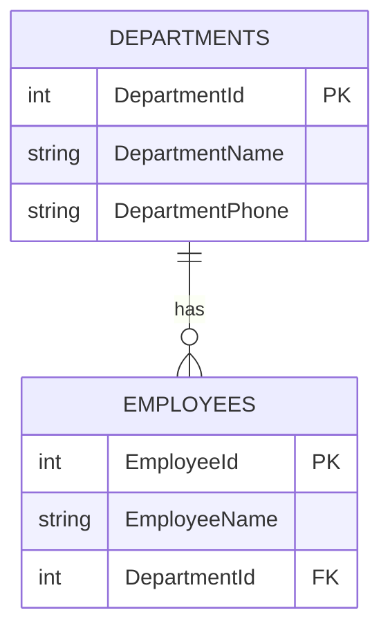

# Relational database concepts

## 1. Relational Data Features

### 📋 Tables
- **Purpose**: Typically intended to store a single *type* of entity/data.
- **Examples**: `Employees`, `Orders`, `Products`, `OrderDetails`.
- **Best practice**: Every table should have a **primary key (PK)**.
- **Common approach**: Use an `Id` column when no natural key exists.

### 🗂️ Indexes
- **Goal**: Improve query performance.
- **Default**: A **primary key** is indexed by default.
- **Storage note**: In many systems, the *clustered* index defines the physical order (often the PK, but not always).
- **Additional indexes**: Create them for columns frequently used in `WHERE`, `JOIN`, `ORDER BY`, or `GROUP BY`.
- **Example**: Indexing `ManagerId` can help even if it’s **not unique**.

### 👓 Views (virtual tables)
- A **view** behaves like a table when querying.
- The data returned is produced by a **stored query** over one or more tables.
- Useful for:
  - **Simplifying** frequently used queries,
  - **Security** (exposing only selected columns/rows),
  - **Abstraction** (hiding underlying schema complexity).

#### Example (conceptual)
| Object | Stores data? | Based on | Typical use |
|--------|--------------|----------|-------------|
| **Table** | ✅ Yes | N/A | Primary data storage |
| **View** | ❌ No* | Query over tables | Simplified/secured access |

\*A standard view doesn’t store data itself (the underlying tables do).

---

<br>

## 2. Normalization
- Normalization is the process of structuring a database to improve data integrity and reduce redundancy (**🇵🇱**: nadmiar / powielanie tych samych informacji).

### 🧠 Normalization — example (Before vs After)

**Idea:** Instead of repeating the same data in many rows (redundancy), we split data into related tables and connect them with keys.

#### ❌ Before (not normalized)
One table mixes **Employee** and **Department** data, so department info is repeated for every employee in that department.

| EmployeeId | EmployeeName | DepartmentId | DepartmentName | DepartmentPhone |
|------------|--------------|--------------|----------------|-----------------|
| 1 | Alice | 10 | Sales | 111-111 |
| 2 | Bob   | 10 | Sales | 111-111 |
| 3 | Cara  | 20 | IT    | 222-222 |

**Problems:**
- **Redundancy**: `DepartmentName` / `DepartmentPhone` repeated many times.
- **Update anomaly**: changing Sales phone requires updating multiple rows.
- **Insert anomaly**: cannot add a department with no employees yet.
- **Delete anomaly**: deleting last employee of a department can remove department info.

#### ✅ After (normalized)
Split into two tables:
- `Employees` (employee-specific columns)
- `Departments` (department-specific columns)

**Departments**
| DepartmentId (PK) | DepartmentName | DepartmentPhone |
|-------------------|----------------|-----------------|
| 10 | Sales | 111-111 |
| 20 | IT    | 222-222 |

**Employees**
| EmployeeId (PK) | EmployeeName | DepartmentId (FK) |
|-----------------|--------------|-------------------|
| 1 | Alice | 10 |
| 2 | Bob   | 10 |
| 3 | Cara  | 20 |

#### 🔗 Relationship diagram (ERD)
If your Markdown viewer supports Mermaid, this will render as a diagram:



#### 🧾 What did we gain?
- One source of truth for department data
- Easier updates (change department phone in one place)
- Better data integrity through **PK/FK** constraints

> Note: This example illustrates the general idea of normalization (commonly associated with 1NF/2NF/3NF).

### 📚 Normal Forms (1NF / 2NF / 3NF) — quick guide

Simple definition for practical purposes is:
1. Separate each entity into its own table.
2. Separate each discrete attribute into its own column.
3. Uniquely identify each entity instance (row) using a primary key.
4. Use foreign key columns to link related entities.

> These rules help you design tables that avoid redundancy and anomalies.

#### 1NF — First Normal Form
- Rule: columns contain **atomic values** (no lists/arrays in a single cell) and rows are uniquely identifiable. Requires a primary key (typically a numeric ID field).
- **🇵🇱**: wartości „pojedyncze” w komórkach (bez list w jednej kolumnie).

**Example (bad → good)**
- ❌ `Skills = "SQL, Python"`
- ✅ separate rows in a child table, e.g. `EmployeeSkills(EmployeeId, Skill)`

#### 2NF — Second Normal Form
- Rule: table is in **1NF** and every non-key column depends on the **whole** primary key (important for **composite keys**). Remove any data that is not related to the *entire primary key*.
- **🇵🇱**: brak zależności od „części klucza” (gdy klucz jest złożony).

**Example**
If you store order items with a composite key `(OrderId, ProductId)`:
- ❌ `OrderItems(OrderId, ProductId, ProductName, Quantity)` → `ProductName` depends only on `ProductId`
- ✅ move product details to `Products(ProductId, ProductName, ...)`

#### 3NF — Third Normal Form
- Rule: table is in **2NF** and has no **transitive dependencies** (non-key depends on another non-key).
- **🇵🇱**: kolumny nie-kluczowe nie powinny zależeć od innych kolumn nie-kluczowych.

**Example**
- ❌ `Employees(EmployeeId, DepartmentId, DepartmentName)` → `DepartmentName` depends on `DepartmentId`, not directly on `EmployeeId`
- ✅ `Employees(EmployeeId, DepartmentId)` + `Departments(DepartmentId, DepartmentName)`

--- 

<br>

## 3. SQL Statements

### Data Definition Language (DDL)
- The data management SQL command around database structures:
CREATE, ALTER, DROP, TRUNCATE, COMMENT, RENAME.

### Data Manipulation Language (DML)
- The SQL commands around data manipulation: SELECT, INSERT, UPDATE, DELETE, LOCK TABLE.

### Data Control Language (DCL)
- Granting rights and permissions to others: GRANT and REVOKE.

---

<br>

## 4. Creating database objects (View, Stored Procedure, Index)

> Examples below are written in SQL Server / Azure SQL style.

### 👓 Create a VIEW
A view is a saved `SELECT` statement. A view is a virtual table based on the results of a SELECT query. You can think of a view as a window on specified rows in one or more underlying tables.

```sql
CREATE VIEW dbo.vwEmployeeDepartments
AS
SELECT
    e.EmployeeId,
    e.EmployeeName,
    d.DepartmentName
FROM dbo.Employees e
JOIN dbo.Departments d
    ON d.DepartmentId = e.DepartmentId;
GO
```

Query it like a table:

```sql
SELECT *
FROM dbo.vwEmployeeDepartments
WHERE DepartmentName = 'Sales';
```

### ⚙️ Create a STORED PROCEDURE
A stored procedure is a stored program that can accept parameters. A stored procedure defines SQL statements that can be run on command. Stored procedures are used to encapsulate programmatic logic in a database for actions that applications need to perform when working with data.

```sql
CREATE PROCEDURE dbo.uspGetEmployeesByDepartment
    @DepartmentId INT
AS
BEGIN
    SET NOCOUNT ON;

    SELECT
        EmployeeId,
        EmployeeName,
        DepartmentId
    FROM dbo.Employees
    WHERE DepartmentId = @DepartmentId
    ORDER BY EmployeeName;
END;
GO
```

Execute it:

```sql
EXEC dbo.uspGetEmployeesByDepartment @DepartmentId = 10;
```

### 🗂️ Create an INDEX
Indexes speed up queries filtering/joining on a column.

> An index helps you search for data in a table. Think of an index over a table like an index at the back of a book. A book index contains a sorted set of references, with the pages on which each reference occurs. When you want to find a reference to an item in the book, you look it up through the index. You can use the page numbers in the index to go directly to the correct pages in the book. Without an index, you might have to read through the entire book to find the references you're looking for.

```sql
CREATE INDEX IX_Employees_DepartmentId
ON dbo.Employees (DepartmentId);
GO
```

> Tip: Indexes help reads, but too many indexes can slow down writes (`INSERT`/`UPDATE`/`DELETE`).

> However, indexes aren't free. An index consumes storage space, and each time you insert, update, or delete data in a table, the indexes for that table must be maintained. This additional work can slow down insert, update, and delete operations.

## 5. Questions

1.  A company needs to ensure that a frequently run complex query executes quickly without modifying the underlying tables. Which database object would be the most appropriate solution?
    - VIEW
    > - **Explanation:** A view is the most appropriate solution because it allows a complex query to be saved and reused without modifying the underlying tables. It simplifies execution and improves maintainability while preserving the original table structure.

<br>

2. A database frequently experiences slow query performance due to large table scans. What database object can be implemented to mitigate this issue effectively?
    - Index
    > - **Explanation:** An index improves query performance by allowing the database engine to quickly locate specific rows without scanning the entire table. It reduces full table scans by enabling efficient data retrieval through indexed access paths.