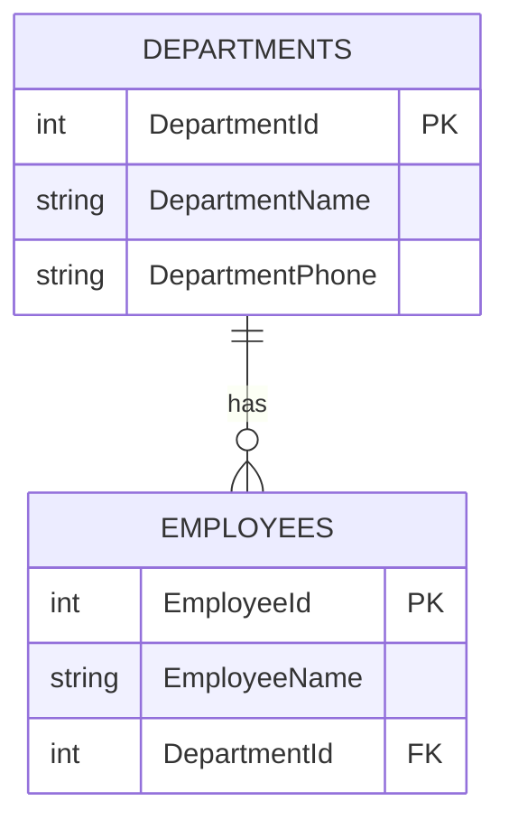

# Relational database concepts

## 1. Relational Data Features

### 📋 Tables
- **Purpose**: Typically intended to store a single *type* of entity/data.
- **Examples**: `Employees`, `Orders`, `Products`, `OrderDetails`.
- **Best practice**: Every table should have a **primary key (PK)**.
- **Common approach**: Use an `Id` column when no natural key exists.

### 🗂️ Indexes
- **Goal**: Improve query performance.
- **Default**: A **primary key** is indexed by default.
- **Storage note**: In many systems, the *clustered* index defines the physical order (often the PK, but not always).
- **Additional indexes**: Create them for columns frequently used in `WHERE`, `JOIN`, `ORDER BY`, or `GROUP BY`.
- **Example**: Indexing `ManagerId` can help even if it’s **not unique**.

### 👓 Views (virtual tables)
- A **view** behaves like a table when querying.
- The data returned is produced by a **stored query** over one or more tables.
- Useful for:
  - **Simplifying** frequently used queries,
  - **Security** (exposing only selected columns/rows),
  - **Abstraction** (hiding underlying schema complexity).

#### Example (conceptual)
| Object | Stores data? | Based on | Typical use |
|--------|--------------|----------|-------------|
| **Table** | ✅ Yes | N/A | Primary data storage |
| **View** | ❌ No* | Query over tables | Simplified/secured access |

\*A standard view doesn’t store data itself (the underlying tables do).

---

 

## 2. Normalization
- Normalization is the process of structuring a database to improve data integrity and reduce redundancy (**🇵🇱**: nadmiar / powielanie tych samych informacji).

### 🧠 Normalization — example (Before vs After)

**Idea:** Instead of repeating the same data in many rows (redundancy), we split data into related tables and connect them with keys.

#### ❌ Before (not normalized)
One table mixes **Employee** and **Department** data, so department info is repeated for every employee in that department.

| EmployeeId | EmployeeName | DepartmentId | DepartmentName | DepartmentPhone |
|------------|--------------|--------------|----------------|-----------------|
| 1 | Alice | 10 | Sales | 111-111 |
| 2 | Bob   | 10 | Sales | 111-111 |
| 3 | Cara  | 20 | IT    | 222-222 |

**Problems:**
- **Redundancy**: `DepartmentName` / `DepartmentPhone` repeated many times.
- **Update anomaly**: changing Sales phone requires updating multiple rows.
- **Insert anomaly**: cannot add a department with no employees yet.
- **Delete anomaly**: deleting last employee of a department can remove department info.

#### ✅ After (normalized)
Split into two tables:
- `Employees` (employee-specific columns)
- `Departments` (department-specific columns)

**Departments**
| DepartmentId (PK) | DepartmentName | DepartmentPhone |
|-------------------|----------------|-----------------|
| 10 | Sales | 111-111 |
| 20 | IT    | 222-222 |

**Employees**
| EmployeeId (PK) | EmployeeName | DepartmentId (FK) |
|-----------------|--------------|-------------------|
| 1 | Alice | 10 |
| 2 | Bob   | 10 |
| 3 | Cara  | 20 |

#### 🔗 Relationship diagram (ERD)
If your Markdown viewer supports Mermaid, this will render as a diagram:

#### 🧾 What did we gain?
- One source of truth for department data
- Easier updates (change department phone in one place)
- Better data integrity through **PK/FK** constraints

> Note: This example illustrates the general idea of normalization (commonly associated with 1NF/2NF/3NF).

### 📚 Normal Forms (1NF / 2NF / 3NF) — quick guide

> These rules help you design tables that avoid redundancy and anomalies.

#### 1NF — First Normal Form
- Rule: columns contain **atomic values** (no lists/arrays in a single cell) and rows are uniquely identifiable. Requires a primary key (typically a numeric ID field).
- **🇵🇱**: wartości „pojedyncze” w komórkach (bez list w jednej kolumnie).

**Example (bad → good)**
- ❌ `Skills = "SQL, Python"`
- ✅ separate rows in a child table, e.g. `EmployeeSkills(EmployeeId, Skill)`

#### 2NF — Second Normal Form
- Rule: table is in **1NF** and every non-key column depends on the **whole** primary key (important for **composite keys**). Remove any data that is not related to the *entire primary key*.
- **🇵🇱**: brak zależności od „części klucza” (gdy klucz jest złożony).

**Example**
If you store order items with a composite key `(OrderId, ProductId)`:
- ❌ `OrderItems(OrderId, ProductId, ProductName, Quantity)` → `ProductName` depends only on `ProductId`
- ✅ move product details to `Products(ProductId, ProductName, ...)`

#### 3NF — Third Normal Form
- Rule: table is in **2NF** and has no **transitive dependencies** (non-key depends on another non-key).
- **🇵🇱**: kolumny nie-kluczowe nie powinny zależeć od innych kolumn nie-kluczowych.

**Example**
- ❌ `Employees(EmployeeId, DepartmentId, DepartmentName)` → `DepartmentName` depends on `DepartmentId`, not directly on `EmployeeId`
- ✅ `Employees(EmployeeId, DepartmentId)` + `Departments(DepartmentId, DepartmentName)`